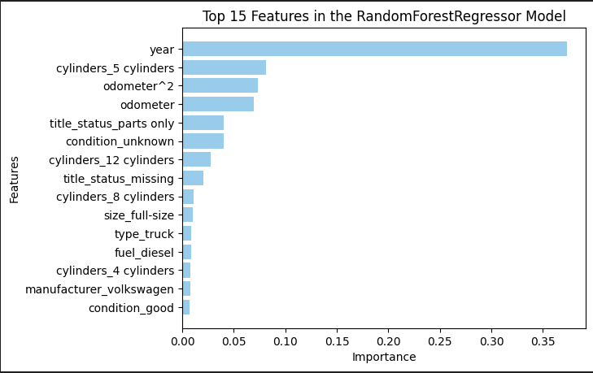

# Modeling Car Prices

Link to full notebook analysis in [Jupyter Notebook file](https://github.com/paultouma24/car_pice_modeling/blob/main/car_price_prediction.ipynb)

Data Source: [425K vehicle dataset from Kaggle](https://github.com/paultouma24/car_pice_modeling/blob/main/data/vehicles.csv)

# Summary

In order to maximize business value of this analysis, I set out to build the best possible regressor model to predict car prices from the provided features.

An initial EDA on the raw dataset highlighted the need to drop outliers and bad data (related odometer and price values). Even further, from the raw data, I created two independent datasets: 
   * dataset A completely devoid of NANs (dropping all rows with them)
   * dataset B with all NANs incldued (imputation later used) 

Feature engineering was performed on both datasets using a mix of ordinal mapping and one-hot-encoding.
   
After cycling through feature selection, cross-validation, and testing multiple regressors for both datasets, the "best" model was trained on dataset B with features selected by Lasso Regression(optimized by GridSearchCV), and data modeled with a RandomForestRegressor. 

Regarding evaluation metric(s), I compared the different models on their mean-absolute-error (MAE) and R-squared(R2) score (discussion of why in the notebook).

The best model achieved a **MAE of $2326.07** and **R2 score of 88.12** for the holdout testing dataset. 
 Exact training and testing scores of all models are shared in the notebook.

# Findings and Recommendations

With the best-performing model, I explored feature importance of the top-15 features. Here they are:

Based on these values, the notable and "actionable" insights that I can gauge are:

1. As we can see, "Year" is the number one driving feature in determining the car price by a long-shot. This visualation along with the Price vs. Year scatter plot (shared in the notebook), confirm this. 

* **Recomendation** Keep year the top priority in selecting car inventory. This value speaks the loudest in the market value.

2. In terms of the other notable features in the top 15, it's interesting how odemeter reading (and its squared value), are important to the model (in fact odemter^2 is more imporant relative to odemeter). 

* **Recomendation** Odometer level is second priority. This is somewhat of a non-linear relationship, but naturally, the younger and less miles a car has, the more higher the market value for the car. 

3. "Parts_only" is a top feature here and is somewhat self-expanatory, as knowing whether or not the full car or just its parts are part of the sale would impact price value.

4. This is somewhat of a hidden gem here (behind the obvious year and odemeter importance), "condition_good" is a top feature over the other conditions ("bad", "excellent", "fair", "like new"). 

* **Recomendation** Though condition is a subjective field, in the used-car market-place, a car in "good" condition is a significant enough condition to impact market value. Buyers might be pickier in other car markets (luxury, etc.) where the other condition values would be paramount, but "condition_good" seems to be that threshold in the used-car market. Use this condition level (over others like "new", "excellent") to weed out cars in your inventory.

